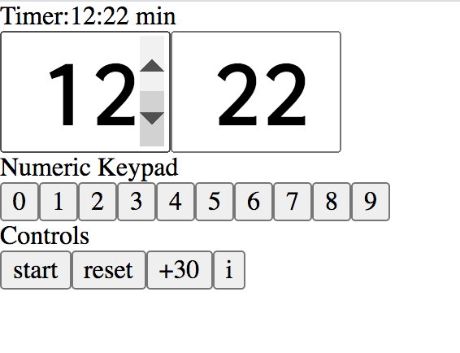
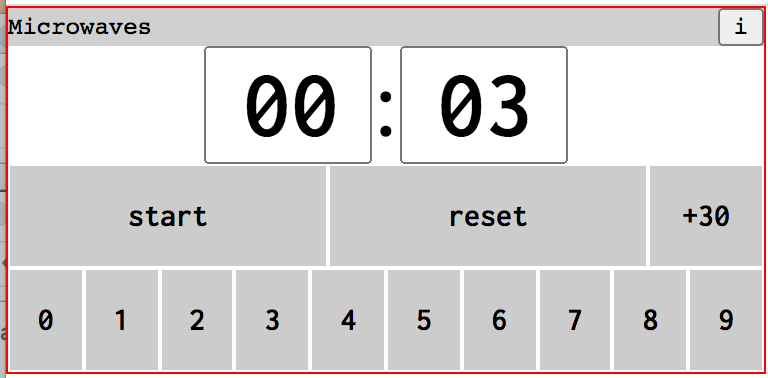
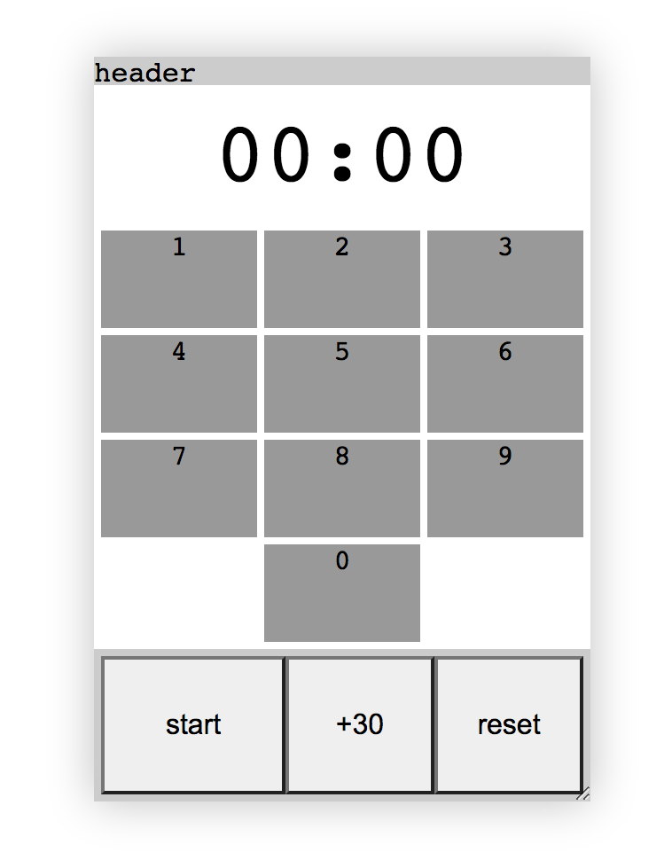
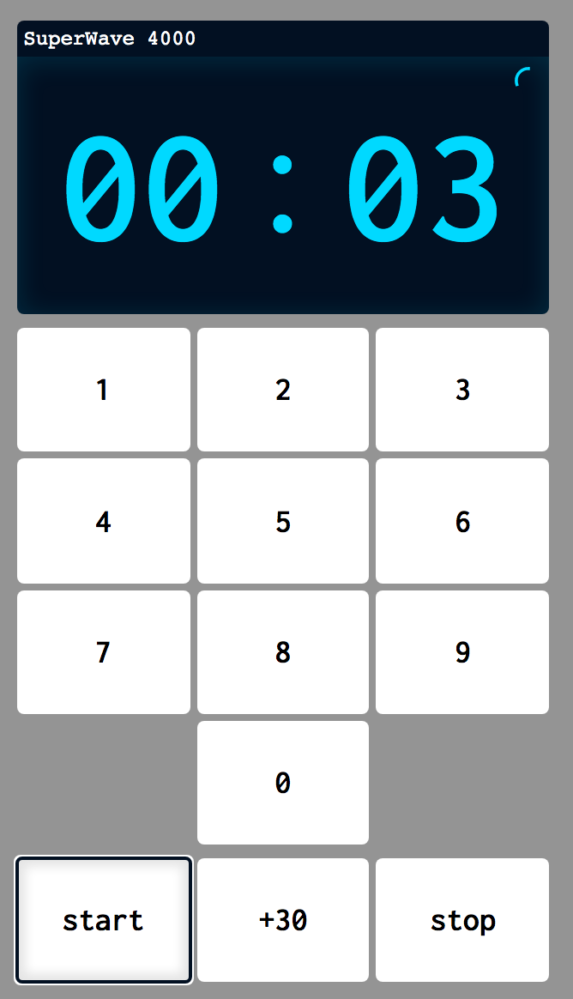

# Introduction

This was a fun code challenge. Below I've outlined a few things about how I approached it, broke it up into tasks, and worked on it over the seven day period.

See `/dist` for the build.

## Installation

To install run

```
npm install
```

To compile in development

```
npm start
```

To compile a prod version

```
npm run build
```

To test the Timer class

```
npm test
```

Built with node `v12.21.0`

## Planning

I received the challenge on a Friday afternoon, and I broke the challenge into the following segments:

1. UI Planning and Feature evaluation
2. Architecture Planning and tooling
3. Timer logic
4. Layout
5. Finishing touches

## UI Considerations

I started by looking at microwaves. I looked at mine, my mom's, and even FaceTimed my aunt to watch her make popcorn. Based on my research, I decided on the following:

### Display

- Four digits: `mm:ss`
- Indicate when the microwave is running
- Indicate when a duration is set

### Interactions

#### Clock

- `mm:ss` should be numeric text inputs. A keyboard user should not need to tab through 0-9 digits.
- Observed microwaves did not prevent the user from entering odd-formatted times like: `05:90` (This was tricky!)
- Disable clock when running.
- The clock should indicate if a duration is set. For example opening/closing the microwave should not reset the time.
- I used a circle indicator to show when a duration had been set, and show the remaining time.

#### Keypad

- Keypad should update from right-to-left. A user input of `0123` for `1m23s` second, rather than `123` for `12m3s`.
- Keypad entry should always clear the current time (unless running.)
- Disable keypad when running.

#### +30s

- `+30s` should work when running.
- `+30s` changes the time input to traditional time display: for example `01:90` plus 30 seconds gives `03:00.` However, it should also be prevented from forcing the display into `hh:mm:ss.` I handled that by restricting the `+30` button to `99m29s` to prevent the clock from clicking over to 1 hour.
- `+30` should work when running, until max duration

### Stop/Reset

- Stop should pause the timer, but not clear the time
- When stopped, the stop button text should change to reset
- Reset should clear the timer, and reset the clock.

### Requirements

- Responsive support for both portrait and landscape
- Text size 100-200%
- Touch, Mouse, and Keyboard Support
- Color contrast

## Layout

I experimented with a few layout ideas

- Keypad presented from `1-9` with centered `0` in portrait mode.
- Keypad 0-9 when in landscape mode.

I started with the base logic and focused on getting the inputs and controls wired to the timer.  


Then I worked on the responsive layout.  


I used a resizable HTML element to prototype the basic responsive structure  


The final version uses an indicator in the top right when the microwave has a set time. The indicator shows the duration while the microwave is running


## Architecture

I selected React for UI, but limited use of Frameworks. I did use a TypeScript library (Strongly Typed Events) to dispatch timer events. The goal of separating the Timer into a TS class was to show an approach to separating logic and creating reusable helpers outside of the UI framework.

1. Separated Timer into a generic Timer Typescript Class
2. Separated **String** and time presentation logic into helpers
3. Divided the App into modular components that output a common datatype.
4. Used a React Provider hook wrap the Timer class and expose it to other React components.

I used TypeScript and Webpack, and configured these myself without using a scaffold app.
